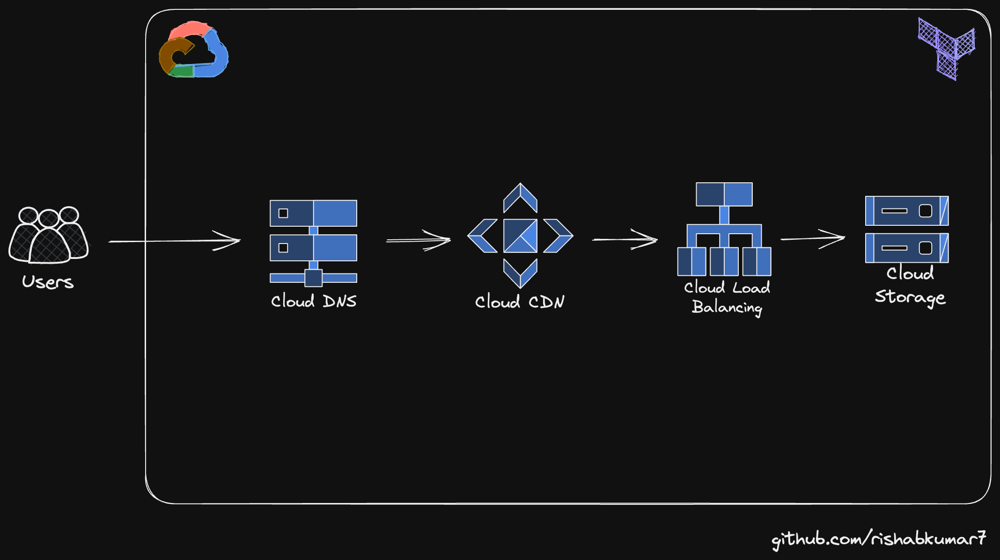

# Terraform Configuration for Static Website Hosting on Google Cloud

This Terraform configuration sets up a static website hosted on Google Cloud Storage and served via Google Cloud CDN.

## Table of Contents

- [Terraform Configuration for Static Website Hosting on Google Cloud](#terraform-configuration-for-static-website-hosting-on-google-cloud)
  * [Table of Contents](#table-of-contents)
  * [Architecture](#architecture)
  * [TFVars](#tfvars)
  * [Resources Created](#resources-created)
  * [Usage](#usage)
  * [Tutorial](#tutorial)


## Architecture



## TFVars

```bash
gcp_svc_key = "../gcp_svc_key.json"
gcp_project = ""
gcp_region  = "europe-west2" # London
```

## Resources Created

1. **Google Storage Bucket**: This is where the website files are stored. The bucket is created in the EU region.

2. **Google Storage Object Access Control**: This makes the bucket public so that anyone can access the website.

3. **Google Storage Bucket Object**: This uploads the `index.html` file from the local directory to the bucket.

4. **Google Compute Global Address**: This reserves a static IP for the website.

5. **Google DNS Managed Zone**: This retrieves the managed DNS zone named `terraform-gcp`.

6. **Google DNS Record Set**: This adds the static IP to the DNS.

7. **Google Compute Backend Bucket**: This adds the bucket as a CDN backend.

8. **Google Compute URL Map**: This creates a URL map for the website.

9. **Google Compute Managed SSL Certificate**: This creates an HTTPS certificate for the website.

10. **Google Compute Target HTTPS Proxy**: This creates an HTTPS proxy for the website.

11. **Google Compute Target HTTP Proxy**: This creates an HTTP proxy for the website.

12. **Google Compute Global Forwarding Rule (HTTP)**: This creates a forwarding rule for HTTP traffic.

13. **Google Compute Global Forwarding Rule (HTTPS)**: This creates a forwarding rule for HTTPS traffic.

## Usage

To use this configuration, you need to have Terraform installed. You can then initialize Terraform in the directory containing this configuration by running `terraform init`. After initialization, you can apply the configuration with `terraform apply`.

Please note that you need to have appropriate credentials set up to access your Google Cloud account. You can do this by setting the `GOOGLE_APPLICATION_CREDENTIALS` environment variable to the path of your service account key file.

## Tutorial

[Learn Terraform with Google Cloud Platform – Infrastructure as Code Course](https://www.youtube.com/watch?v=VCayKl82Lt8&t=281s)